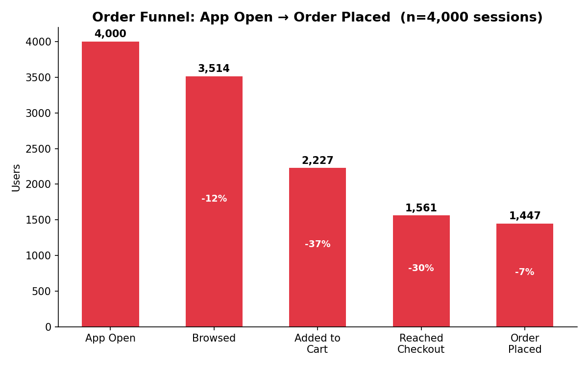
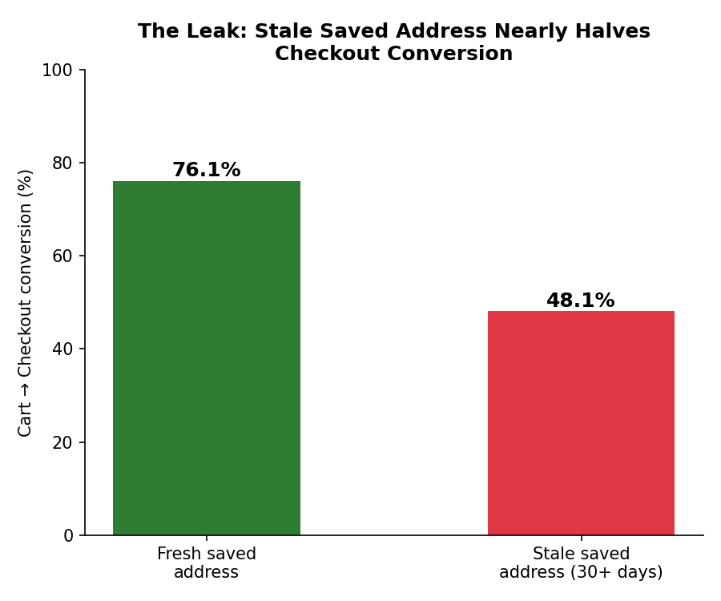
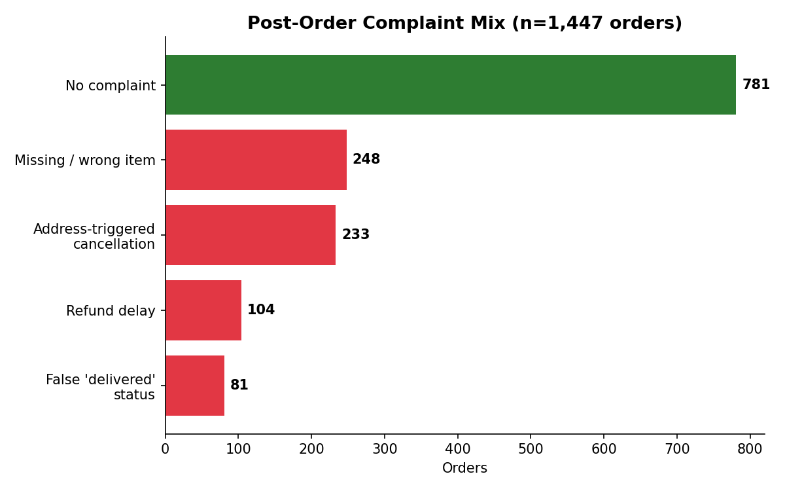
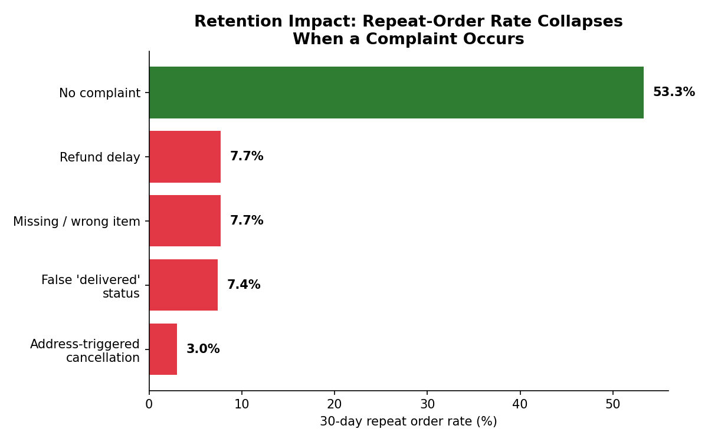

# Reducing Checkout Drop-Off and Refund-Driven Churn on Zomato
### A Product Analytics Case Study — Funnel, Metrics, and a Proposed Fix

**Author:** [Your Name] · **Role target:** Product Analyst
**Tools used:** SQL (SQLite), Python (pandas, matplotlib)
**Data:** Synthetic dataset (4,000 sessions / 1,447 orders) modeled on complaint
patterns documented in public Zomato reviews (Trustpilot, PissedConsumer,
ConsumerComplaints, mid-2026)

---

## 1. Problem Statement

Public reviews of Zomato in 2026 repeatedly surface the same three complaints:
refunds that take multiple support sessions to resolve, orders auto-cancelled
because the app charged an old/stale saved address, and items marked
"delivered" that never arrived. These aren't just support-quality issues —
they're **retention problems disguised as support tickets**.

I built a funnel + retention model to answer three PA-relevant questions:

1. Where exactly do users drop off before even placing an order?
2. Which post-order failure mode does the most damage to repeat behavior?
3. What's the smallest product fix with the largest retention payoff?

## 2. Metrics Framework

| Metric | Definition | Why it matters |
|---|---|---|
| **Checkout conversion** | Carts that reach checkout / total carts | Isolates pre-purchase friction |
| **Complaint rate** | Orders with a complaint / total orders | Post-purchase quality proxy |
| **Refund TTR** | Hours from refund request to resolution | Customer Effort Score proxy |
| **30-day repeat rate** | Users who reorder within 30 days / total orders | North-star retention metric |

## 3. Funnel Analysis (SQL)

```sql
SELECT
    COUNT(*) AS app_opened,
    SUM(browsed) AS browsed,
    SUM(added_to_cart) AS added_to_cart,
    SUM(reached_checkout) AS reached_checkout,
    SUM(order_placed) AS order_placed
FROM funnel_events;
```



Overall conversion from app open to order placed is **36.2%**, with the
sharpest single drop-off at **Cart → Checkout (-29.9%)** — bigger than the
Browse → Cart drop. That's unusual: checkout is normally a low-friction step
for repeat users, so a 30% leak there means something specific is broken.

## 4. Isolating the Leak: Stale Saved Address

Cross-referencing the "days since address last used" flag against checkout
conversion:

```sql
SELECT stale_saved_address,
       ROUND(100.0*SUM(reached_checkout)/COUNT(*),1) AS checkout_conv
FROM funnel_events WHERE added_to_cart = 1
GROUP BY stale_saved_address;
```



Users with a fresh saved address convert at **76.1%**; users whose saved
address hasn't been used in 30+ days convert at just **48.1%** — a
**28-point gap**. This single segment (22% of all carts) accounts for a
disproportionate share of total checkout loss.

## 5. Post-Order Complaint Mix

```sql
SELECT complaint_type, COUNT(*) AS orders
FROM orders GROUP BY complaint_type ORDER BY orders DESC;
```



46% of placed orders end with some form of complaint. **Address-triggered
cancellation (16.1%)** and **missing/wrong item (17.1%)** are the two
largest buckets — together over 4x the size of "false delivered status."

## 6. Refund Time-to-Resolution by Type

```sql
SELECT complaint_type, ROUND(AVG(refund_ttr_hours),1) AS avg_ttr_hours
FROM orders WHERE refund_requested = 1
GROUP BY complaint_type ORDER BY avg_ttr_hours DESC;
```

| Complaint type | Avg TTR (hours) |
|---|---|
| False "delivered" status | 51.9 |
| Address-triggered cancellation | 36.8 |
| Refund delay only | 22.0 |
| Missing / wrong item | 10.6 |

Address-triggered cancellations don't just happen more often — they also
take **3.5x longer to resolve** than a simple missing-item refund. This
matches the "passed around support for hours" pattern seen repeatedly in
public reviews.

## 7. The Retention Cliff (the key finding)

```sql
SELECT
    CASE WHEN complaint_type='none' THEN 'No complaint' ELSE 'Had complaint' END AS segment,
    ROUND(100.0*SUM(repeat_order_30d)/COUNT(*),1) AS repeat_rate_pct
FROM orders GROUP BY segment;
```



- **No complaint:** 53.3% reorder within 30 days
- **Any complaint:** 6.0% reorder within 30 days
- **Address-triggered cancellation specifically: 3.0%** — the single worst
  segment, worse even than a fully failed delivery

This is the number a PA would put in front of a PM: **a fixable checkout-flow
bug is associated with a ~50-point swing in 30-day retention** for the users
it touches.

## 8. Recommended Product Fix

**"Stale Address Confirmation Nudge"** — a lightweight, low-engineering-cost
change:

- If the selected delivery address hasn't been used in the last 30 days,
  surface a one-tap confirmation ("Deliver to [address]? ✓ Yes · Edit") at
  the top of checkout, *before* payment — not after cancellation.
- Pair with a **self-serve refund path** for address-triggered cancellations
  specifically (auto-approve, no chat queue), since this complaint type has
  the longest TTR relative to how simple the fix usually is (wrong address =
  no ambiguity about fault).

**Why this fix, specifically:** it targets the segment that is simultaneously
(a) the largest fixable share of checkout drop-off, (b) tied for the slowest
refund resolution, and (c) the single worst retention outcome — i.e. the
highest-leverage node in the whole funnel.

## 9. Projected Impact (illustrative)

If the nudge recovers even half of the 28-point checkout-conversion gap for
stale-address users, and automated refunds lift that segment's repeat rate
from 3.0% halfway toward the no-complaint baseline of 53.3%:

- **+14 points** checkout conversion for ~22% of all carts
- **+25 points** 30-day repeat rate for the address-cancellation segment
- Translates to roughly **60–70 additional repeat orders per 1,000 affected
  users per month** in this model — the kind of number a launch review would
  actually track

*(These are directional estimates from a synthetic model, meant to
demonstrate the analysis method — not a claim about Zomato's real numbers.)*

## 10. A/B Test Design

Before shipping the fix broadly, this is the experiment I'd run to validate it.

**Hypothesis:** Surfacing a one-tap address confirmation at checkout for
users with a stale (30+ day) saved address will increase checkout
conversion for that segment, without hurting overall order economics.

**Unit of randomization:** User ID (not session), to avoid users seeing
inconsistent checkout experiences across visits.

**Arms:**
- **Control** — existing checkout flow (silent stale-address use, cancel
  → refund-request path if wrong)
- **Treatment** — pre-payment confirmation nudge + automated refund path
  for address-triggered cancellations

**Eligibility:** Only users who reach "Add to Cart" with a stale (30+ day)
saved address — this is ~22% of all carts, so the test targets the exact
segment the fix is designed for rather than diluting effect size across
everyone.

**Primary metric:** Cart → Checkout conversion rate for the eligible
segment.
- Baseline: 48.1%
- Minimum detectable effect (MDE): +10 points (to 58.1%) — roughly a third
  of the full 28-point gap seen between stale- and fresh-address users, a
  conservative target since the nudge won't fully close the gap
- **Sample size:** ~390 users per arm (α=0.05, power=0.80, two-proportion
  z-test) — at ~476 eligible carts observed over 60 days in this dataset,
  a 2-3 week test at current-ish volume would reach this

**Guardrail metrics** (should not get worse):
- **30-day repeat rate** for the eligible segment — must not regress
  below the 3.0% baseline; ideally improves as fewer users get
  auto-cancelled
- **Checkout time** (seconds) — the nudge adds a step, so watch for it
  materially slowing down checkout for users who *don't* need it
- **Overall order volume** — confirm the nudge isn't creating net
  hesitation/abandonment beyond the address-confirmation moment itself

**Secondary metric:** Refund-related support ticket volume for
address-triggered cancellations (expect this to drop toward zero, since
automated refund removes the need to contact support at all).

**Read-out plan:** 2-3 week test, powered on the primary metric; ship if
primary metric hits the MDE with no guardrail regression; if checkout time
regresses meaningfully, iterate on the nudge's UI (e.g., default to "Yes,
deliver here" with edit as secondary action) rather than shipping as-is.

## 11. What I'd Want Real Data For

This model is built on synthetic data calibrated to public review patterns,
not Zomato's internal logs. With real event-level data, the next steps would
be: A/B test the nudge against a holdout, segment the retention cliff by
order value and city, and check whether the effect is causal (complaint →
churn) or partly confounded (already-churning users complain more).

---

**Files in this project:** `generate_data.py` (synthetic data generation),
`load_db.py` + `analysis.sql` (SQL layer), `make_charts.py` (visualization),
`case_study.md` (this write-up).
